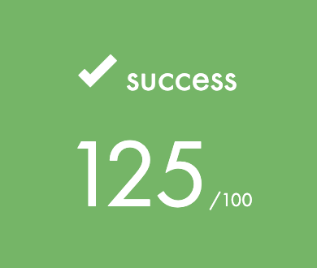
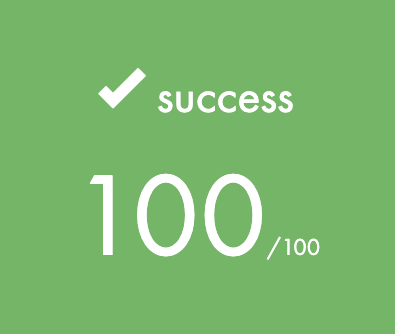

# School 21 'common core rank 2' projects

|Project |Description|Grade|
|-|-|-|
|pipex|This project aims to make you understand a bit deeper two concepts that you already know: the redirections and the pipes| 
|push_swap|This project involves sorting data on a stack, with a limited set of instructions, and the smallest number of moves. To make this happen, you will have to manipulate various sorting algorithms and choose the most appropriate solution(s) for optimized data sorting|
|fdf|This project is about representing a landscape as a 3D object in which all surfaces are outlined in lines|???